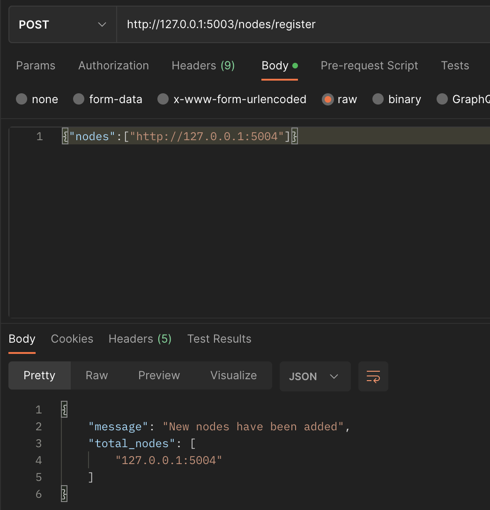
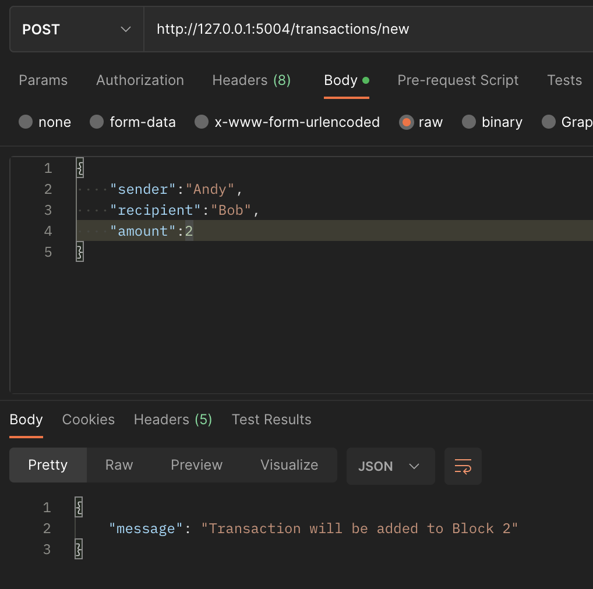
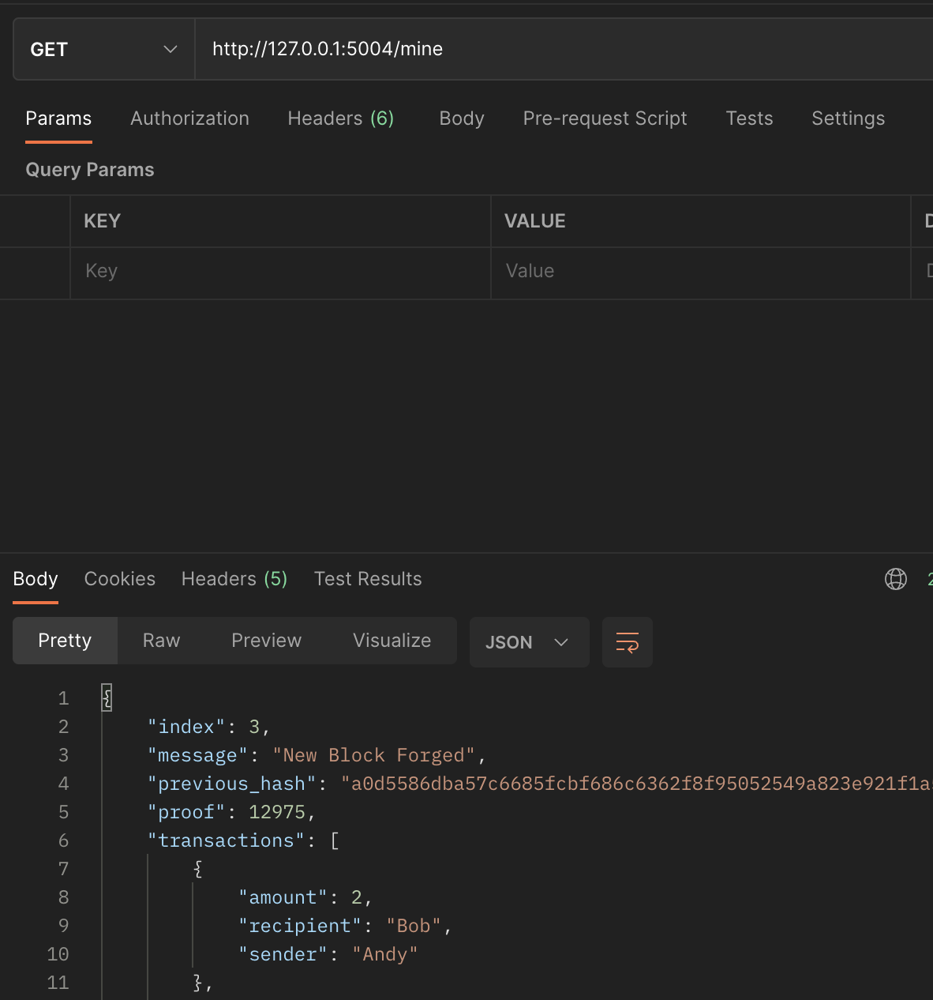
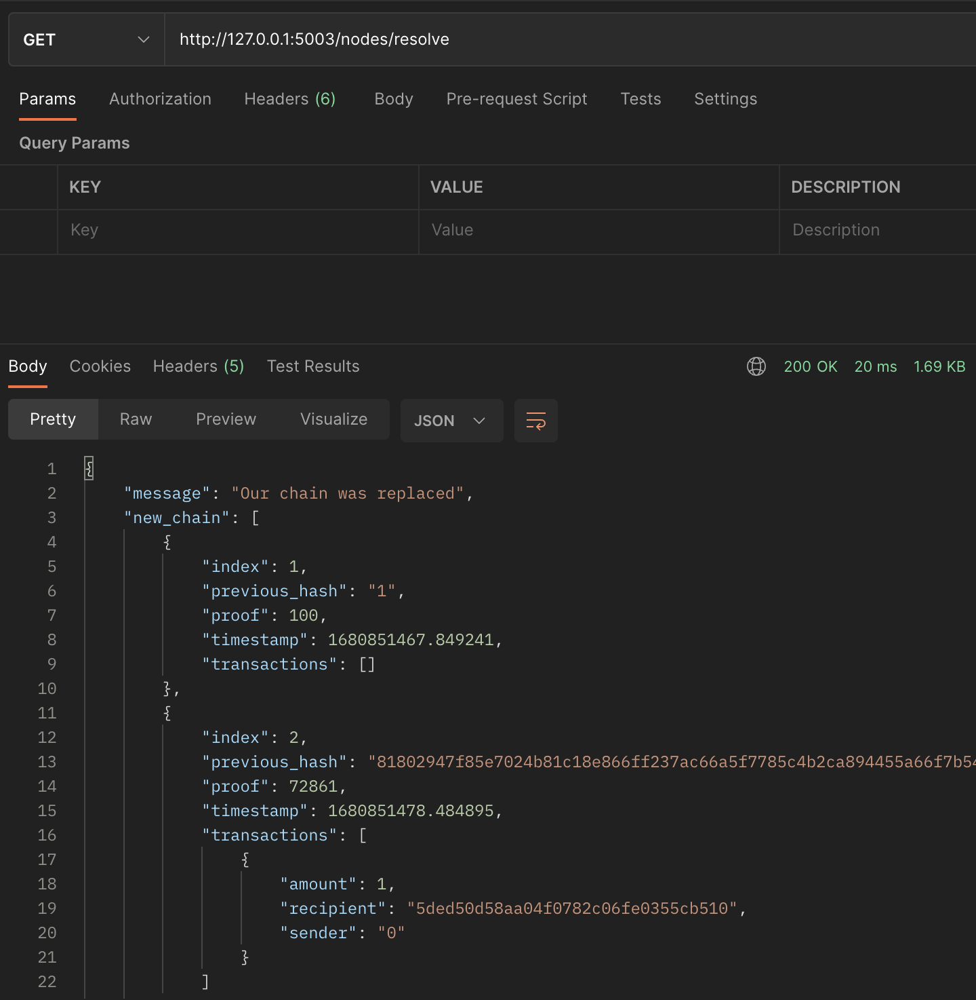

# Cryptocurrency_demo

用python實作一個簡單的加密貨幣，可以了解區塊鏈的運作流程。

# How to use

- /mine [GET]
    - 打包一個區塊
- /transactions/new [POST]
    - 建立新交易
        - sender
        - recipient
        - amount
- /get_chain    [GET]
    - 查看區塊鏈
- /nodes/register   [POST]
    - 註冊一個新的節點
- /nodes/resolve [GET]
    - 如果找到一個有效的鏈，其長度大於主鏈，則進行替換

# demo流程

- 用一台電腦開啟程式,port 預設 `5003`，當成主鏈
    - `python main.py`
- 在另一台電腦或是再開一個終端機，port 換成另一個，當成測試鏈
    - `python main.py --port 5004`
- 先註冊新節點
    - 
- 在`5004`上先做交易
    - 
- `5004`打包區塊
    - 
- `5004`查看當前鏈上的區塊，如果有打包多次，可以看到有大於一個的區塊
    - `http://127.0.0.1:5004/get_chain`
- `5003`查看主鏈上的區塊，只有一個創世區塊
    - `http://127.0.0.1:5003/get_chain`
- 把`5004`上的鏈合併到主鏈(`5003`)上
    - 

# Ref
    - https://medium.com/@vanflymen/learn-blockchains-by-building-one-117428612f46
    

